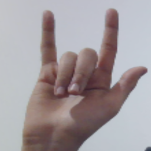
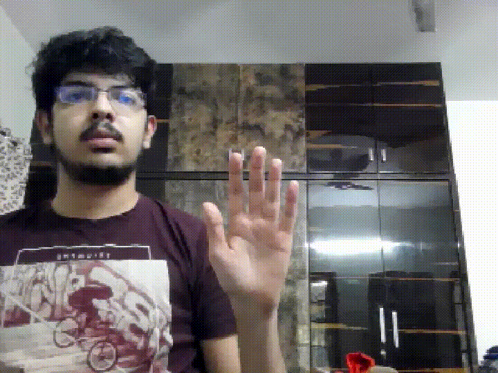
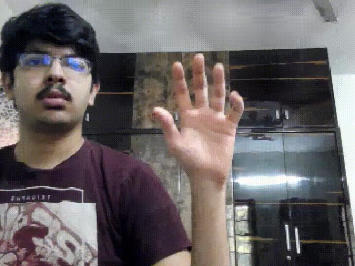

# gestures-mediapipe


Built on top of [mediapipe](https://github.com/google/mediapipe), this repo aims to be a tool to navigate a computer through hand gestures. Using this tool, it is possible to:

1. Use your hand to act as a replacement for the mouse.
2. Perform hand gestures to control system parameters like screen brightness, volume etc. 


### Overview

The hand keypoints are detected using google's mediapipe. These keypoints are then fed into a Python script through [ZeroMQ](https://zeromq.org). 

The tool utilizes the concept of **modes** i.e. we are currently in one of two modes, either **mouse** or **gestures**. 

The **mouse** mode comprises of all functionality relevant to the mouse, which includes mouse tracking and the various possible mouse button actions. The mouse is tracked simply by moving the hand in mouse mode, where the tip of the index finger reflects the position of the cursor. The gestures related to the mouse actions are detailed below. A dataset was created (see `data/static_gestures_data.csv` and `static_data_collection.py`) and a neural network was trained on these gestures and with the use of the python library `pyautogui`, mouse actions are simulated.

The **gestures** mode is for more advanced dynamic gestures involving a moving hand. It consists of various other actions to interface with the system, such as modifying screen brightness, switching workspaces, taking screenshots etc. The data for these dynamic gestures comes from [SHREC2017 dataset](http://www-rech.telecom-lille.fr/shrec2017-hand/). Dynamic gestures are detected by holding down the `Ctrl` key, performing the gesture, and then releasing the key.


The project consists of a few distinct pieces which are:

* The mediapipe executable - A modified version of the hand tracking example given in mediapipe, this executable tracks the keypoints, stores them in a protobuf, and transmits them using ZMQ.
* Gesture Receive - See `gesture_receiver.py`, responsible for handling the ZMQ stream and utilizing all the following modules.
* Mouse tracking - See `mouse_tracker.py`, responsible for moving the cursor using the position of the index finger.
* Config detection - See `gesture_recognizer.py`, takes in the keypoints from the mediapipe executable, and converts them into a high level description of the state of the hand.
* Config action - See `gesture_executor.py`, uses the configuration from the previous module, and executes an action depending on various factors, i.e. current and previous states of the hand, whether such an action is permissible in the given context etc.


### Notes

* Dynamic gestures are only supported with right hand, as all data from SHREC is right hand only.
* A left click can be performed by performing the mouse down and gesture and immediately returning to the open hand gesture to register a single left mouse button click.
* For dynamic gestures to work properly, you may need to change the keycodes being used in `gesture_executor.py`. Use the given `find_keycode.py` to find the keycodes of the keys used to change screen brightness and volumee. Finally, system shortcuts may need to be remapped so that the shortcuts work even with the Ctrl key held down. For example, in addition to the usual default behaviour of `<Prnt_Screen>` taking a screenshot, you may need to add `<Ctrl+Prnt_Screen>` as a shortcut as well. 

### [Demo video link](https://drive.google.com/file/d/1taQIUU69DhX6CG1gJdgwnz1Sqavqm7kn/view?usp=sharing)

A visualization of the various modules : 


### Gestures


#### Static Gestures

| Gesture name   | Gesture Action   | Image                               |
| -------------- | ---------------- | --------------------------------    |
| seven          | Left Mouse Down  |          |
| eight          | Double Click     |          |
| four           | Right Mouse Down |            |
| spiderman      | Scroll           |  |
| hitchhike      | Mode Switch      |  |

#### Dynamic Gestures

| Gesture name             | Gesture Action                     | Gif                                              |
| --------------           | ----------------                   | ---------                                        |
| Swipe Right              | Move to the workspace on the right |              |
| Swipe Left               | Move to the workspace on the left  |                |
| Swipe Up                 | Increase screen brightness         |                    |
| Swipe Down               | Decrease screen brightness         |                |
| Rotate Clockwise         | Increase volume                    |                |
| Rotate Counter Clockwise | Decrease volume                    |  |
| Grab                     | Screenshot                         |        |
| Tap                      | Mode Switch                        |                            |

### Requirements

As well as mediapipe's own requirements, there a few other things required for this project.

* ZeroMQ 

The zeromq library (*libzmq.so*) must be installed and symlinked into this directory. The header only C++ binding **cppzmq** must also be installed and its header (*zmq.hpp*) symlinked into the directory. The python module **pyzmq** must also be installed for python to read the keypoints being sent.

* protobuf 

The protobuf module in Python must be installed, through the use of `pip` or your distribution's package manager.

* pyautogui & pynput

pyautogui is a GUI automation python module used, in this case, to simulate the movement of the mouse. As with other python packages, to be installed through `pip` or package manager e.g. `apt`. pyautogui's keyboard functions were not enough for the requirements of the dynamic gestures, thus the python library pynput is also used.

* Pytorch & pytorch-lightning

Used to train and deploy the neural net which recognizes gestures. [pytorch-lightning](https://github.com/PyTorchLightning/pytorch-lightning), a lightweight wrapper over Pytorch for cleaner development, is also used.

* xdotool

Switching workspaces with dynamic gestures requires the command line utility `xdotool`

* Standard libraries

The standard libraries in machine learning projects, `numpy`, `pandas` and `scikit-learn` are also utilized.

### Usage

1. Clone mediapipe and set it up. Make sure the provided hand tracking example is working.
2. Clone this repo in the top level directory of mediapipe. Install all dependencies.
3. Run the instructions below to build and then execute the code. 

*Note:* Run build instructions in the `mediapipe/` directory, not inside this directory.

#### Mediapipe Executable

##### GPU (Linux only)
``` sh
bazel build -c opt --verbose_failures --copt -DMESA_EGL_NO_X11_HEADERS --copt -DEGL_NO_X11 gestures-mediapipe:hand_tracking_gpu

GLOG_logtostderr=1 bazel-bin/gestures-mediapipe/hand_tracking_gpu --calculator_graph_config_file=gestures-mediapipe/hand_tracking_desktop_live.pbtxt

```

##### CPU
``` sh
bazel build -c opt --define MEDIAPIPE_DISABLE_GPU=1 gestures-mediapipe:hand_tracking_cpu

GLOG_logtostderr=1 bazel-bin/gestures-mediapipe/hand_tracking_cpu --calculator_graph_config_file=gestures-mediapipe/hand_tracking_desktop_live.pbtxt

```

#### Python Script

``` python
python gestures-mediapipe/gesture_receiver.py

```

### Repo Overview

* models -> Stores the trained model(s) which can be called by other files for inference
* proto -> Holds the definitions of the protobufs used in the project for data transfer
* BUILD -> Various build instructions for Bazel
* `static_data_collection.py` -> Script to create static gesture dataset 
* `data/gestures_mapping.json` -> Stores the encoding of the gestures as integers
* `data/static_gestures_data.csv` -> Dataset created with data_collection.py 
* `data/dynamic_gestures_mapping.json` -> Stores the encoding of the dynamic gestures as integers
* `hand_tracking_desktop_live.pbtxt` -> Definition of the mediapipe calculators being used. Check out mediaipe for more details.
* `hand_tracking_landmarks.cc` -> Source code for the mediapipe executable. GPU version is Linux only.
* `model.py` -> Declaration of the model(s) used.
* `train_model.py` -> Trains the "GestureNet" model for static gestures and saves to disk
* `dynamic_train_model.py` -> Transforms and loads data from the SHREC dataset, trains a neural network and saves to disk. 
* `find_keycode.py` -> A sample program from pynput used to find the keycode of the key that was pressed. Useful in case the brightness and audio keys vary.
* `gesture_receiver.py` -> Handles the stream of data coming from the mediapipe executable by passing it to the various other modules.
* `mouse_tracker.py` -> Functions which implement mouse tracking.
* `gesture_recognizer.py` -> Functions which use the trained neural networks to recognize gestures from keypoints.
* `gesture_executor.py` -> Functions which implement the end action with an input gesture. E.g. Left Click, Reduce Screen Brightness


### Useful Information

[Joints of the hand](https://en.wikipedia.org/wiki/Interphalangeal_joints_of_the_hand)

[HandCommander](https://www.deuxexsilicon.com/handcommander/)

[Video recorded with VokoScreenNG](https://github.com/vkohaupt/vokoscreenNG)
