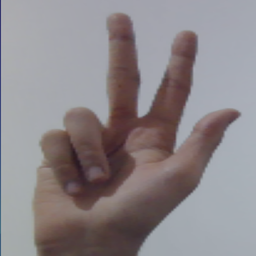
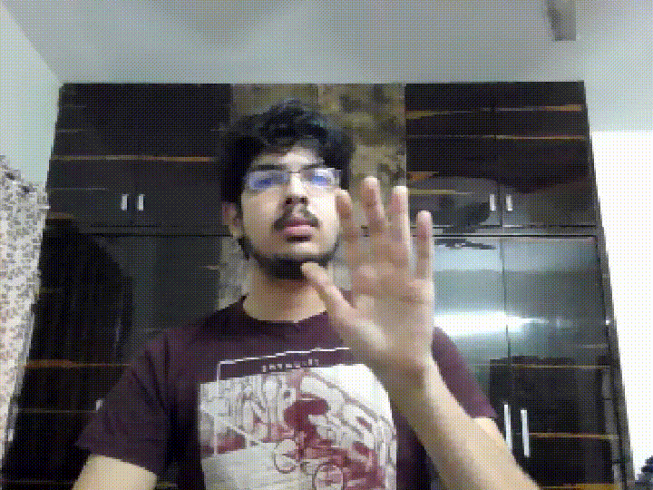
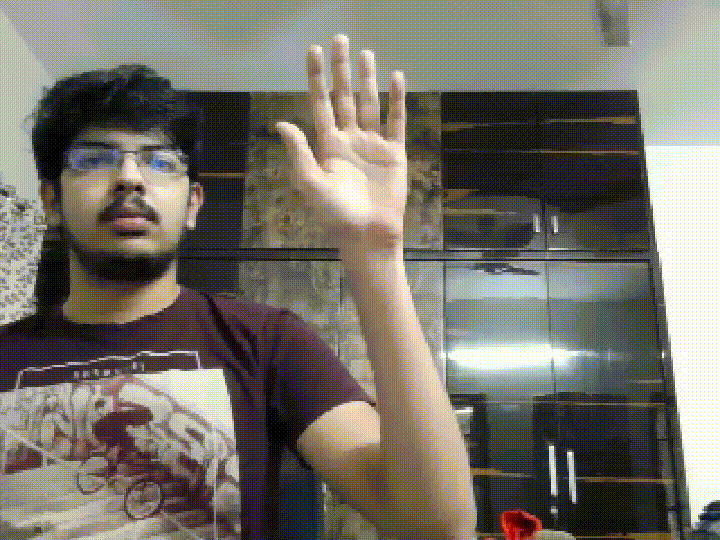
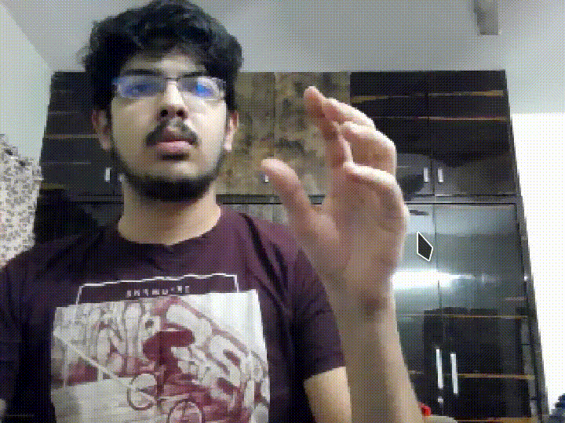
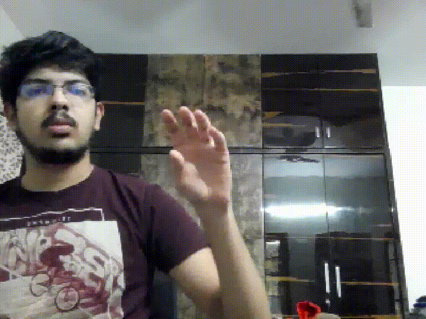
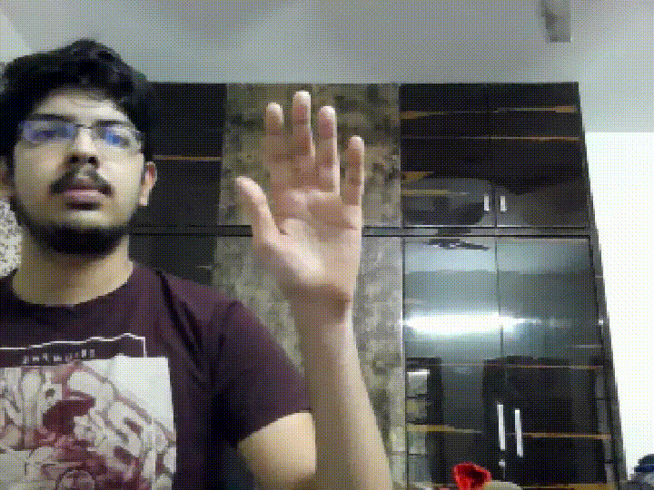

# gestures-mediapipe


Built on top of [mediapipe](https://github.com/google/mediapipe), this project aims to be a tool to interact with a computer through hand gestures. Out of the box, using this tool, it is possible to:

1. Use your hand to act as a replacement for the mouse.
2. Perform hand gestures to control system parameters like screen brightness, volume etc.

However, it is possible to extend and customize the functionality of the application in numerous ways:

1. Remap existing hand gestures to different functions in order to better suit your needs.
2. Create custom functionality through the use of either python functions or shell scripts.
3. Collect data and create your own custom gestures to use with existing gestures. 

### [Demo video link](https://drive.google.com/file/d/1taQIUU69DhX6CG1gJdgwnz1Sqavqm7kn/view?usp=sharing)

#### [Models link](https://drive.google.com/drive/folders/16lbPkdYWcmLfx0oFo01A5FwTiCDK5DDK?usp=sharing)

#### [Dataset link](https://drive.google.com/drive/folders/1zMFQVKvpAhU-EKGxQNyFXKTu1TgBH23L?usp=sharing)

### Requirements

As well as mediapipe's own requirements, there are a few other libraries required for this project.

* **ZeroMQ** - The zeromq library (*libzmq.so*) must be installed and symlinked into this directory. The header only C++ binding **cppzmq** must also be installed and its header (*zmq.hpp*) symlinked into the directory. 
* **pyzmq**
* **protobuf** 
* **pyautogui**
* **pynput**
* **pytorch**
* **pytorch-lightning**
* **xdotool**

### Usage

1. Clone mediapipe and set it up. Make sure the provided hand tracking example is working.
2. Clone this repo in the top level directory of mediapipe. Install all dependencies.
3. Download the `models/` folder from the link above and place it in the `gestures-mediapipe/` directory.
4. Run the instructions below to build and then execute the code. 

*Note:* Run build instructions in the `mediapipe/` directory, not inside this directory.

#### Mediapipe Executable

##### GPU (Linux only)
``` sh
bazel build -c opt --verbose_failures --copt -DMESA_EGL_NO_X11_HEADERS --copt -DEGL_NO_X11 gestures-mediapipe:hand_tracking_gpu

GLOG_logtostderr=1 bazel-bin/gestures-mediapipe/hand_tracking_gpu --calculator_graph_config_file=gestures-mediapipe/hand_tracking_desktop_live.pbtxt

```

##### CPU
``` sh
bazel build -c opt --define MEDIAPIPE_DISABLE_GPU=1 gestures-mediapipe:hand_tracking_cpu

GLOG_logtostderr=1 bazel-bin/gestures-mediapipe/hand_tracking_cpu --calculator_graph_config_file=gestures-mediapipe/hand_tracking_desktop_live.pbtxt

```

#### Python Script

``` python
python gestures-mediapipe/gesture_receiver.py

```

### Overview

The hand keypoints are detected using google's mediapipe. These keypoints are then fed into a Python script through zmq.  The tool utilizes the concept of **modes** i.e. we are currently in one of two modes, either **mouse** or **gestures**. 

The **mouse** mode comprises of all functionality relevant to the mouse, which includes mouse tracking and the various possible mouse button actions. The mouse is tracked simply by moving the hand in mouse mode, where the tip of the index finger reflects the position of the cursor. The gestures related to the mouse actions are detailed below. A dataset was created and a neural network was trained on these gestures and with the use of the python library `pyautogui`, mouse actions are simulated.

The **gestures** mode is for more advanced dynamic gestures involving a moving hand. It consists of various other actions to interface with the system, such as modifying screen brightness, switching workspaces, taking screenshots etc. The data for these dynamic gestures comes from [SHREC2017 dataset](http://www-rech.telecom-lille.fr/shrec2017-hand/). Dynamic gestures are detected by holding down the `Ctrl` key, performing the gesture, and then releasing the key.

The project consists of a few distinct pieces which are:

* The mediapipe executable - A modified version of the hand tracking example given in mediapipe, this executable tracks the keypoints, stores them in a protobuf, and transmits them using ZMQ.
* Gesture Receive - See `gesture_receiver.py`, responsible for handling the ZMQ stream and utilizing all the following modules.
* Mouse tracking - See `mouse_tracker.py`, responsible for moving the cursor using the position of the index finger.
* Config detection - See `gesture_recognizer.py`, takes in the keypoints from the mediapipe executable, and converts them into a high level description of the state of the hand, i.e. a gesture name.
* Config action - See `gesture_executor.py`, uses the gesture name from the previous module, and executes an action.

### Notes

* Dynamic gestures are only supported with right hand, as all data from SHREC is right hand only.
* A left click can be performed by performing the mouse down and gesture and immediately returning to the open hand gesture to register a single left mouse button click.
* For dynamic gestures to work properly, you may need to change the keycodes being used in `gesture_executor.py`. Use the given `find_keycode.py` to find the keycodes of the keys used to change screen brightness and volumee. Finally, system shortcuts may need to be remapped so that the shortcuts work even with the Ctrl key held down. For example, in addition to the usual default behaviour of `<Prnt_Screen>` taking a screenshot, you may need to add `<Ctrl+Prnt_Screen>` as a shortcut as well. 

### Customization

**gestures-mediapipe** is highly customizable and can be easily extended in various ways. The existing gesture-actions can be remapped easily, new actions can be defined (either a python function or a shel script, opening up a world of possiiblity to interact with your computer), and finally, if you so desire, you can capture data to create your own gestures and retrain the network to utilize your own custom gestures. The ways to accomplish the above are briefly described in this section. 

#### Remapping gestures and adding new actions 

If the existing functionality satisfies you, but you would like to map other functions to the gestures, this is easily done. The default mappings are stored in `data/action_config.json`. Copy the configuration to a new file in any directory, and remap away! The format of the config file is:

`{'gesture_name':['type','func_name','args']}`

Where, gesture_name is the name of the gesture that is detected, type is either `sh`(shell) or `py`(python). `func_name` is the name of a python function if the type is `py`. If the type is `sh`, then `func_name` is either a shell command or `./shell_script.sh`. Finally, `args` is only applicable for python functions. As the name suggests, it allows you to pass in arguments to the python functions. These arguments can be predefined (`state`,`keyboard`,`none`) or an arbitrary value. Arbitrary values must be wrapped in `[]`. Refer `data/action_config.json` and `gesture_executor.py` for more details.

To remap functionality, all you need to do is swap the values for the gestures you wish to remap.

Adding new actions is a slightly more involved process involving modifying the value for a given gesture. The first step is to either write the python function (in `user_config.py`) or the shell script for the action you wish to perform. The next step is to decompose your functionality in the format of the file, and finally replace the default action with your own.

It is encouraged to make all custom configuration in a new file rather than replace the old. So, before your modifications, copy `data/action_config.json` and create a new file. After your modifications are done in the new file, you can run the application with your custom config using `python gesture_receiver.py --config-path my_custom_config.json`

#### Adding new gestures

To extend this application and create new gestures, there are a few requirements. Firstly, download the data from from the dataset link given above, and place in the `data/` directory. Record your new gestures, static or dynamic, with the data_collection scripts. Finally, retrain the models by running the train_model scripts, i.e. static or dynamic depending on the new data you collected.

### Gestures

#### Static Gestures

| Gesture name   | Gesture Action   | Image                               |
| -------------- | ---------------- | --------------------------------    |
| seven          | Left Mouse Down  |          |
| eight          | Double Click     |          |
| four           | Right Mouse Down |            |
| spiderman      | Scroll           |  |
| hitchhike      | Mode Switch      |  |

#### Dynamic Gestures

| Gesture name             | Gesture Action                     | Gif                                              |
| --------------           | ----------------                   | ---------                                        |
| Swipe Right              | Move to the workspace on the right |              |
| Swipe Left               | Move to the workspace on the left  |                |
| Swipe Up                 | Increase screen brightness         |                    |
| Swipe Down               | Decrease screen brightness         |                |
| Rotate Clockwise         | Increase volume                    |                |
| Rotate Counter Clockwise | Decrease volume                    |  |
| Grab                     | Screenshot                         |        |
| Tap                      | Mode Switch                        |                            |

<details>
<summary><b>Repo Overview</b></summary>
<br>
<ul>
<li> models -> Stores the trained model(s) which can be called by other files for inference </li>
<li> proto -> Holds the definitions of the protobufs used in the project for data transfer</li>
<li> BUILD -> Various build instructions for Bazel</li>
<li> <code>static_data_collection.py</code> -> Script to create a custom static gesture dataset.  </li>
<li> <code>dynamic_data_collection.py</code> -> Script to create a custom dynamic gesture dataset.  </li>
<li> <code>data/static_gestures_mapping.json</code> -> Stores the encoding of the static gestures as integers</li>
<li> <code>data/dynamic_gestures_mapping.json</code> -> Stores the encoding of the dynamic gestures as integers</li>
<li> <code>data/static_gestures_data.csv</code> -> Dataset created with data_collection.py </li>
<li> <code>data/action_config.json</code> -> Configuration of what gesture maps to what action. </li>
<li> <code>hand_tracking_desktop_live.pbtxt</code> -> Definition of the mediapipe calculators being used. Check out mediaipe for more details.</li>
<li> <code>hand_tracking_landmarks.cc</code> -> Source code for the mediapipe executable. GPU version is Linux only.</li>
<li> <code>model.py</code> -> Definition of the models used.</li>
<li> <code>static_train_model.py</code> -> Trains the "GestureNet" model for static gestures and saves to disk</li>
<li> <code>dynamic_train_model.py</code> -> Trains the "ShrecNet" model for dynamic gestures and saves to disk</li>
<li> <code>find_keycode.py</code> -> A sample program from pynput used to find the keycode of the key that was pressed. Useful in case the brightness and audio keys vary.</li>
<li> <code>gesture_receiver.py</code> -> Handles the stream of data coming from the mediapipe executable by passing it to the various other modules.</li>
<li> <code>mouse_tracker.py</code> -> Functions which implement mouse tracking.</li>
<li> <code>gesture_recognizer.py</code> -> Functions which use the trained neural networks to recognize gestures from keypoints.</li>
<li> <code>gesture_executor.py</code> -> Functions which implement the end action with an input gesture. E.g. Left Click, Reduce Screen Brightness</li>
<li> <code>config.py</code> -> Stores the configuration and state of the application in dataclasses for easy access. </li>
<li> <code>user_config.py</code> -> Stores the definition of all the actions that will be executed when a particular gesture is detected. </li>
</ul>
</details>

### Useful Information

[Joints of the hand](https://en.wikipedia.org/wiki/Interphalangeal_joints_of_the_hand)

[HandCommander](https://www.deuxexsilicon.com/handcommander/)

[Video recorded with VokoScreenNG](https://github.com/vkohaupt/vokoscreenNG)
